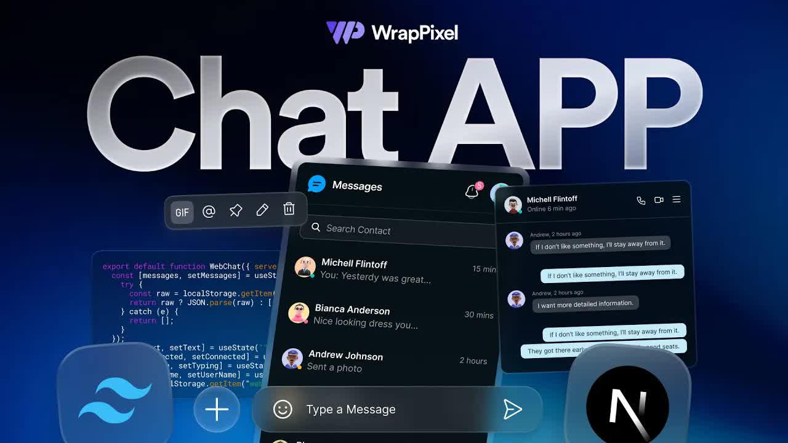

# Build-a-Realtime-Chat-App-with-Next.js,-Socket.IO-&-Clerk-Auth｜-Full-Stack-Tutorial-2025-｜-WrapPixel

  <picture>
    
  </picture>

 

---

## Video Information

| Property | Value |
|----------|-------|
| **Video Name** | `Build-a-Realtime-Chat-App-with-Next.js,-Socket.IO-&-Clerk-Auth｜-Full-Stack-Tutorial-2025-｜-WrapPixel` |
| **Original Link** | [YouTube Video](https://www.youtube.com/watch?v=IdWTe_5slKo) |
| **Total Size** | **16 parts** - **709.89 MB** |
| **Quality** | **1080** |
| **Status** | **Complete (100%)** |
| **Password Protected** | **NO** |

---

---

## 🔤 Subtitles

| # | File | Link |
|---|------|------|
| 1 | `subtitle.zip` | [Download](https://raw.githubusercontent.com/hghayebi/Ourtube/main/videos/Build-a-Realtime-Chat-App-with-Next.js%2C-Socket.IO-%26-Clerk-Auth%EF%BD%9C-Full-Stack-Tutorial-2025-%EF%BD%9C-WrapPixel/subtitle.zip) |

> Contains all available subtitle languages. Extract to get `.vtt` files.

## Download Links

> ⬇️ Download **all parts**, then open `Build-a-Realtime-Chat-App-with-Next.js,-Socket.IO-&-Clerk-Auth｜-Full-Stack-Tutorial-2025-｜-WrapPixel.zip` — the other parts are found automatically.

| # | File | Link |
|---|------|------|
| 1 | `Build-a-Realtime-Chat-App-with-Next.js,-Socket.IO-&-Clerk-Auth｜-Full-Stack-Tutorial-2025-｜-WrapPixel.z01` | [Download](https://raw.githubusercontent.com/hghayebi/Ourtube/main/videos/Build-a-Realtime-Chat-App-with-Next.js%2C-Socket.IO-%26-Clerk-Auth%EF%BD%9C-Full-Stack-Tutorial-2025-%EF%BD%9C-WrapPixel/Build-a-Realtime-Chat-App-with-Next.js%2C-Socket.IO-%26-Clerk-Auth%EF%BD%9C-Full-Stack-Tutorial-2025-%EF%BD%9C-WrapPixel.z01) |
| 2 | `Build-a-Realtime-Chat-App-with-Next.js,-Socket.IO-&-Clerk-Auth｜-Full-Stack-Tutorial-2025-｜-WrapPixel.z02` | [Download](https://raw.githubusercontent.com/hghayebi/Ourtube/main/videos/Build-a-Realtime-Chat-App-with-Next.js%2C-Socket.IO-%26-Clerk-Auth%EF%BD%9C-Full-Stack-Tutorial-2025-%EF%BD%9C-WrapPixel/Build-a-Realtime-Chat-App-with-Next.js%2C-Socket.IO-%26-Clerk-Auth%EF%BD%9C-Full-Stack-Tutorial-2025-%EF%BD%9C-WrapPixel.z02) |
| 3 | `Build-a-Realtime-Chat-App-with-Next.js,-Socket.IO-&-Clerk-Auth｜-Full-Stack-Tutorial-2025-｜-WrapPixel.z03` | [Download](https://raw.githubusercontent.com/hghayebi/Ourtube/main/videos/Build-a-Realtime-Chat-App-with-Next.js%2C-Socket.IO-%26-Clerk-Auth%EF%BD%9C-Full-Stack-Tutorial-2025-%EF%BD%9C-WrapPixel/Build-a-Realtime-Chat-App-with-Next.js%2C-Socket.IO-%26-Clerk-Auth%EF%BD%9C-Full-Stack-Tutorial-2025-%EF%BD%9C-WrapPixel.z03) |
| 4 | `Build-a-Realtime-Chat-App-with-Next.js,-Socket.IO-&-Clerk-Auth｜-Full-Stack-Tutorial-2025-｜-WrapPixel.z04` | [Download](https://raw.githubusercontent.com/hghayebi/Ourtube/main/videos/Build-a-Realtime-Chat-App-with-Next.js%2C-Socket.IO-%26-Clerk-Auth%EF%BD%9C-Full-Stack-Tutorial-2025-%EF%BD%9C-WrapPixel/Build-a-Realtime-Chat-App-with-Next.js%2C-Socket.IO-%26-Clerk-Auth%EF%BD%9C-Full-Stack-Tutorial-2025-%EF%BD%9C-WrapPixel.z04) |
| 5 | `Build-a-Realtime-Chat-App-with-Next.js,-Socket.IO-&-Clerk-Auth｜-Full-Stack-Tutorial-2025-｜-WrapPixel.z05` | [Download](https://raw.githubusercontent.com/hghayebi/Ourtube/main/videos/Build-a-Realtime-Chat-App-with-Next.js%2C-Socket.IO-%26-Clerk-Auth%EF%BD%9C-Full-Stack-Tutorial-2025-%EF%BD%9C-WrapPixel/Build-a-Realtime-Chat-App-with-Next.js%2C-Socket.IO-%26-Clerk-Auth%EF%BD%9C-Full-Stack-Tutorial-2025-%EF%BD%9C-WrapPixel.z05) |
| 6 | `Build-a-Realtime-Chat-App-with-Next.js,-Socket.IO-&-Clerk-Auth｜-Full-Stack-Tutorial-2025-｜-WrapPixel.z06` | [Download](https://raw.githubusercontent.com/hghayebi/Ourtube/main/videos/Build-a-Realtime-Chat-App-with-Next.js%2C-Socket.IO-%26-Clerk-Auth%EF%BD%9C-Full-Stack-Tutorial-2025-%EF%BD%9C-WrapPixel/Build-a-Realtime-Chat-App-with-Next.js%2C-Socket.IO-%26-Clerk-Auth%EF%BD%9C-Full-Stack-Tutorial-2025-%EF%BD%9C-WrapPixel.z06) |
| 7 | `Build-a-Realtime-Chat-App-with-Next.js,-Socket.IO-&-Clerk-Auth｜-Full-Stack-Tutorial-2025-｜-WrapPixel.z07` | [Download](https://raw.githubusercontent.com/hghayebi/Ourtube/main/videos/Build-a-Realtime-Chat-App-with-Next.js%2C-Socket.IO-%26-Clerk-Auth%EF%BD%9C-Full-Stack-Tutorial-2025-%EF%BD%9C-WrapPixel/Build-a-Realtime-Chat-App-with-Next.js%2C-Socket.IO-%26-Clerk-Auth%EF%BD%9C-Full-Stack-Tutorial-2025-%EF%BD%9C-WrapPixel.z07) |
| 8 | `Build-a-Realtime-Chat-App-with-Next.js,-Socket.IO-&-Clerk-Auth｜-Full-Stack-Tutorial-2025-｜-WrapPixel.z08` | [Download](https://raw.githubusercontent.com/hghayebi/Ourtube/main/videos/Build-a-Realtime-Chat-App-with-Next.js%2C-Socket.IO-%26-Clerk-Auth%EF%BD%9C-Full-Stack-Tutorial-2025-%EF%BD%9C-WrapPixel/Build-a-Realtime-Chat-App-with-Next.js%2C-Socket.IO-%26-Clerk-Auth%EF%BD%9C-Full-Stack-Tutorial-2025-%EF%BD%9C-WrapPixel.z08) |
| 9 | `Build-a-Realtime-Chat-App-with-Next.js,-Socket.IO-&-Clerk-Auth｜-Full-Stack-Tutorial-2025-｜-WrapPixel.z09` | [Download](https://raw.githubusercontent.com/hghayebi/Ourtube/main/videos/Build-a-Realtime-Chat-App-with-Next.js%2C-Socket.IO-%26-Clerk-Auth%EF%BD%9C-Full-Stack-Tutorial-2025-%EF%BD%9C-WrapPixel/Build-a-Realtime-Chat-App-with-Next.js%2C-Socket.IO-%26-Clerk-Auth%EF%BD%9C-Full-Stack-Tutorial-2025-%EF%BD%9C-WrapPixel.z09) |
| 10 | `Build-a-Realtime-Chat-App-with-Next.js,-Socket.IO-&-Clerk-Auth｜-Full-Stack-Tutorial-2025-｜-WrapPixel.z10` | [Download](https://raw.githubusercontent.com/hghayebi/Ourtube/main/videos/Build-a-Realtime-Chat-App-with-Next.js%2C-Socket.IO-%26-Clerk-Auth%EF%BD%9C-Full-Stack-Tutorial-2025-%EF%BD%9C-WrapPixel/Build-a-Realtime-Chat-App-with-Next.js%2C-Socket.IO-%26-Clerk-Auth%EF%BD%9C-Full-Stack-Tutorial-2025-%EF%BD%9C-WrapPixel.z10) |
| 11 | `Build-a-Realtime-Chat-App-with-Next.js,-Socket.IO-&-Clerk-Auth｜-Full-Stack-Tutorial-2025-｜-WrapPixel.z11` | [Download](https://raw.githubusercontent.com/hghayebi/Ourtube/main/videos/Build-a-Realtime-Chat-App-with-Next.js%2C-Socket.IO-%26-Clerk-Auth%EF%BD%9C-Full-Stack-Tutorial-2025-%EF%BD%9C-WrapPixel/Build-a-Realtime-Chat-App-with-Next.js%2C-Socket.IO-%26-Clerk-Auth%EF%BD%9C-Full-Stack-Tutorial-2025-%EF%BD%9C-WrapPixel.z11) |
| 12 | `Build-a-Realtime-Chat-App-with-Next.js,-Socket.IO-&-Clerk-Auth｜-Full-Stack-Tutorial-2025-｜-WrapPixel.z12` | [Download](https://raw.githubusercontent.com/hghayebi/Ourtube/main/videos/Build-a-Realtime-Chat-App-with-Next.js%2C-Socket.IO-%26-Clerk-Auth%EF%BD%9C-Full-Stack-Tutorial-2025-%EF%BD%9C-WrapPixel/Build-a-Realtime-Chat-App-with-Next.js%2C-Socket.IO-%26-Clerk-Auth%EF%BD%9C-Full-Stack-Tutorial-2025-%EF%BD%9C-WrapPixel.z12) |
| 13 | `Build-a-Realtime-Chat-App-with-Next.js,-Socket.IO-&-Clerk-Auth｜-Full-Stack-Tutorial-2025-｜-WrapPixel.z13` | [Download](https://raw.githubusercontent.com/hghayebi/Ourtube/main/videos/Build-a-Realtime-Chat-App-with-Next.js%2C-Socket.IO-%26-Clerk-Auth%EF%BD%9C-Full-Stack-Tutorial-2025-%EF%BD%9C-WrapPixel/Build-a-Realtime-Chat-App-with-Next.js%2C-Socket.IO-%26-Clerk-Auth%EF%BD%9C-Full-Stack-Tutorial-2025-%EF%BD%9C-WrapPixel.z13) |
| 14 | `Build-a-Realtime-Chat-App-with-Next.js,-Socket.IO-&-Clerk-Auth｜-Full-Stack-Tutorial-2025-｜-WrapPixel.z14` | [Download](https://raw.githubusercontent.com/hghayebi/Ourtube/main/videos/Build-a-Realtime-Chat-App-with-Next.js%2C-Socket.IO-%26-Clerk-Auth%EF%BD%9C-Full-Stack-Tutorial-2025-%EF%BD%9C-WrapPixel/Build-a-Realtime-Chat-App-with-Next.js%2C-Socket.IO-%26-Clerk-Auth%EF%BD%9C-Full-Stack-Tutorial-2025-%EF%BD%9C-WrapPixel.z14) |
| 15 | `Build-a-Realtime-Chat-App-with-Next.js,-Socket.IO-&-Clerk-Auth｜-Full-Stack-Tutorial-2025-｜-WrapPixel.z15` | [Download](https://raw.githubusercontent.com/hghayebi/Ourtube/main/videos/Build-a-Realtime-Chat-App-with-Next.js%2C-Socket.IO-%26-Clerk-Auth%EF%BD%9C-Full-Stack-Tutorial-2025-%EF%BD%9C-WrapPixel/Build-a-Realtime-Chat-App-with-Next.js%2C-Socket.IO-%26-Clerk-Auth%EF%BD%9C-Full-Stack-Tutorial-2025-%EF%BD%9C-WrapPixel.z15) |
| 16 | `Build-a-Realtime-Chat-App-with-Next.js,-Socket.IO-&-Clerk-Auth｜-Full-Stack-Tutorial-2025-｜-WrapPixel.zip` | [Download](https://raw.githubusercontent.com/hghayebi/Ourtube/main/videos/Build-a-Realtime-Chat-App-with-Next.js%2C-Socket.IO-%26-Clerk-Auth%EF%BD%9C-Full-Stack-Tutorial-2025-%EF%BD%9C-WrapPixel/Build-a-Realtime-Chat-App-with-Next.js%2C-Socket.IO-%26-Clerk-Auth%EF%BD%9C-Full-Stack-Tutorial-2025-%EF%BD%9C-WrapPixel.zip) |

---

## How to Extract

Download all parts into the **same folder**, then:

| OS | Steps |
|----|-------|
| **Windows** | Double-click `Build-a-Realtime-Chat-App-with-Next.js,-Socket.IO-&-Clerk-Auth｜-Full-Stack-Tutorial-2025-｜-WrapPixel.zip` — opens in Explorer, WinRAR, or 7-Zip automatically |
| **Mac** | Double-click `Build-a-Realtime-Chat-App-with-Next.js,-Socket.IO-&-Clerk-Auth｜-Full-Stack-Tutorial-2025-｜-WrapPixel.zip` — extracts with Archive Utility or The Unarchiver |
| **Linux** | `unzip Build-a-Realtime-Chat-App-with-Next.js,-Socket.IO-&-Clerk-Auth｜-Full-Stack-Tutorial-2025-｜-WrapPixel.zip` or right-click → Extract Here (Ark/File Manager) |
| **Android** | Tap `Build-a-Realtime-Chat-App-with-Next.js,-Socket.IO-&-Clerk-Auth｜-Full-Stack-Tutorial-2025-｜-WrapPixel.zip` in your file manager — or use [ZArchiver](https://play.google.com/store/apps/details?id=ru.zdevs.zarchiver) |

---

*This tool created by [avasam.ir](https://avasam.ir)*
